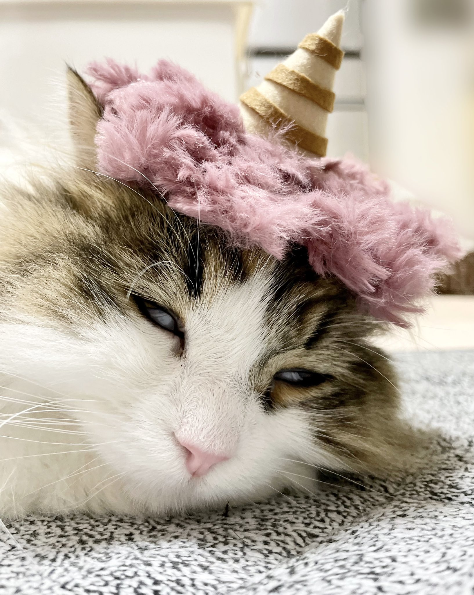
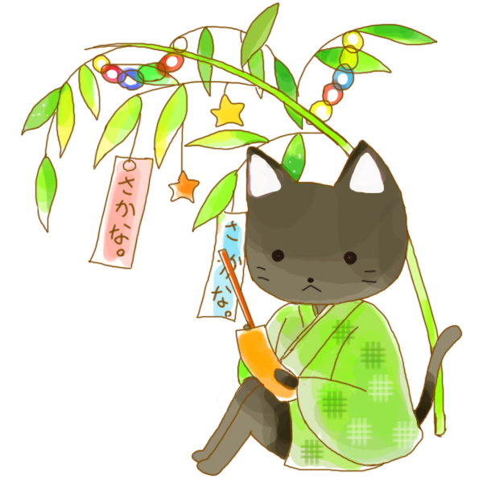

# 学習ノート2022

このリポジトリは個人の生涯学習ノートの代わりです。
ゆっくりしていってね。

- [生涯学習の５つの目的と５つの作戦](#５つの目的と５つの作戦)

イメージ動画: ツッパることが男の勲章

[](https://www.youtube.com/watch?v=9OR5fqDQl9Y "Video Title")

ボクたちだけのエンジニア流 **フルコース** を作っていく!


- 1Q
  - [エンジニア目標はこちら](https://github.com/Eigo-Mt-Fuji/portfolio-2021/blob/main/docs/README-%E5%80%8B%E4%BA%BA%E5%AD%A6%E7%BF%92-20211215.md)
  - [お仕事の進捗はこちら](https://github.com/Eigo-Mt-Fuji/efg-confidential/blob/main/%E4%BA%8B%E6%A5%AD%E9%80%B2%E6%8D%97.md)

- 2Q
  - [README-教養-座学-実用ITリテラシー.md](./docs/README-教養-座学-実用ITリテラシー.md)
  - [README-専門-プログラミング基礎学習.md](./docs/README-専門-プログラミング基礎学習.md)
  - [README-特設・LINEブロックチェーン.md](./docs/README-特設・LINEブロックチェーン.md)

- 3Q
  - [イーサリアムを学ぶノート～イーサリアムを学んで過ごす夏休みの1ヶ月を書く～](https://note.com/efujikawa/m/m47203006ff7d)
  - [Rust学習ノート#1](https://note.com/efujikawa/m/m0a8f4652a667)
  - [RustとdApp開発を実際やってみるノート](https://note.com/efujikawa/m/m2b7793629425)
  - [英単語暗記環境づくり - AnkiとAnki-Connect導入～Macとスマホで同期～](https://note.com/efujikawa/n/n88031af778f8)
    - [diagram](https://app.diagrams.net/#G1bEddP9Vjb1q12D9y6nF_VFy55yIG3H2v)

- 4Q
  - 次年度以降のOSSコミットメントに向けた準備活動
    - https://github.com/Eigo-Mt-Fuji/efg-confidential/issues/46#issuecomment-1221325383
        - OSSへのコミットのお作法と要件を把握して、言語化する
        - 得意分野の狙いを定める
        - 要件を満たす準備に時間を当てる
            - 対象分野のキャッチアップ(方法を考えること、実践すること)
            - 英語力
            - 開発ツールの熟練度を高めて（たとえ仕事をしながらでも）短時間で効率的なコミットができる状態にする
        - OSSコミッティーの入り込み方をイメージトレーニングする
        - 後はやって見るだけ！

- 検討中
  - [README-専門-XR・メタバース.md](./docs/README-専門-XR・メタバース.md)
  - [README-教養-座学-歴史.md](./docs/README-教養-座学-歴史.md)
  - [README-教養-座学-実用数学.md](./docs/README-教養-座学-実用数学.md)
  - [README-投資-実践-市況チェック.md](./docs/README-投資-実践-市況チェック.md)
  - [README-投資-実践-決算短信チェック.md](./docs/README-投資-実践-決算短信チェック.md)
  - [README-投資-実践-半導体市場理解度・解像度up.md](./docs/README-投資-実践-半導体市場理解度・解像度up.md)
  - [README-投資-実践-再生可能エネルギー理解度・解像度up.md](./docs/README-投資-実践-再生可能エネルギー理解度・解像度up.md)

- 実験
  - AWS CloudQuest


## ５つの目的と５つの作戦

- 自分の生涯学習項目に目的と作戦を当てはめる

|やりたいこと|目的|作戦|
|:----:|:----:|:----|
|XR,Web AR|創作|感覚だいじに,行動だいじに|
|Web AR|仕事|成果だいじに|
|投資能力開発|資金|感覚だいじに,効率だいじに|
|ブロックチェーン|専門教養|効率だいじに,精度だいじに |
|SDGs|基礎教養|感覚だいじに|

- 生涯学習ってなに?おいしいのという方
  - こちらをどうぞ
    - https://twitter.com/_rokujo/status/1519838790562754560?t=X49bvIbda5YVtXU1HqoTiw&s=19

- 詳細なプランはissueで検討していく
  - [[能力開発]このリポジトリのねらい～持続的能力開発～ #37 good first issue](https://github.com/Eigo-Mt-Fuji/efg-confidential/issues/37)

- ５つの目的

|目的|説明|
|:----:|:----|
|創作|自分で創るための学習|
|仕事|お仕事のための学習|
|資金|お金を稼ぐための学習|
|専門教養|専門的な分野の生きた知識・知恵をみにつけるための学習|
|基礎教養|一般的な分野の生きた知識・知恵をみにつけるための学習|

- ５つの目的と５つの作戦

|目的|作戦|
|:----:|:----|
|創作|感覚だいじに,行動だいじに|
|仕事|成果だいじに|
|資金|感覚だいじに,効率だいじに|
|専門教養|効率だいじに,精度だいじに |
|基礎教養|感覚だいじに|

  - 感覚だいじに
    - 見続けるのが中心。記憶に残し、感覚を掴む
    - ある程度続けることも大事
    - ちゃんとしたものや良いコンテンツを見ることは大事
    - 見出し画像やイメージ動画もここでつける。
    - 場合によっては有料教材を使う
    - 感覚を掴む以外のアウトプットは必須ではない。感覚を掴むために有効活用する。
  - 効率だいじに
    - わかりやすい動画教材の視聴
    - よくできたまとめサイトの目次、電子書籍などのインプット
    - 自分で考えたりクリエイティブの必要はない。
  - 行動だいじに
    - とにかく実行すること。
    - 継続して実行すること。
    - 夢と目標とちょっとの刺激が必要。
    - 精度や成果物のボリュームは必要ではない。ある程度実行することは大事なので、無理なく飽きずに続けられるように目標を調整する。
  - 精度だいじに
    - 品質が必要。アウトプットの見栄え、文書であれば見出しの構造などにもこだわる。
    - 先に感覚を掴んで、行動してアウトプットしたあとに挑む。
    - キャッチコピーや、アイキャッチ画像やイメージ動画はここでアップデートする
    - まとまった時間と集中があったほうがよい。
    - 適切なチェックと手直しが必要。
  - 成果だいじに
    - 感覚と精度と行動と効率ぜんぶあわせた作戦になる。センスと勘に任せてタイミングを測ってアウトプット

- 脳トレ-脳の処理速度を高めるトレーニングをどうぞ.
  - https://jp.rohto.com/kidseye/v-rohto-junior/sokunou-training/#ranking

## 学習支援プロセス

`自分で学習するときも学習支援プロセス必要。自分に対して、現状把握／目標設定／フォロー／啓発を工夫して行う`

- 現状把握／目標設定は必ず事前にやる
  - 泥臭い上に時間もかかる。ただやらない場合と比べて効果が段違い。目標ロストしないためにも必ずやる

- フォローは、目的と学習時の作戦によって調整する(対自分のときはフォロー イコール セルフチェック・ふりかえり)
  - 感覚だいじにのフェーズは、フォローはこまめに行う。
  - 行動だいじに作戦はフォローの比率は下がる。
  - 精度だいじに作戦でのフォロー イコール チェック集中。
  - 成果だいじに作戦でのフォローはは心を鬼にして見ること。結果にコミットする
  - 途中で向いてないことがわかったら、さっさと撤退(撤退勧告もフォローのうち)

- 啓発は、活躍している人の記事とか動画をみたり、報酬の設定をすると効果が大きい(対自分の場合の啓発 イコール 単に学びになる・やる気がでるコンテンツを探す＆見続ける)

## 参考: 学習状況確認フレームワーク

`学習を実践する人の現状を捉えるときに役立つ3つのフレームワーク`

- マズローの欲求5段階説  https://prdx.co.jp/visions-prdx/maslow/#:~:text=%E3%83%9E%E3%82%BA%E3%83%AD%E3%83%BC%E3%81%AE%E6%AC%B2%E6%B1%825%E6%AE%B5%E9%9A%8E%E8%AA%AC%E3%81%A8%E3%81%AF%E3%80%81%E4%BA%BA%E9%96%93%E3%81%AE,%E3%81%AE%E7%90%86%E8%AB%96%E3%81%AE%E3%81%93%E3%81%A8%E3%81%A7%E3%81%99%E3%80%82&text=%E3%83%9E%E3%82%BA%E3%83%AD%E3%83%BC%E3%81%AE%E6%AC%B2%E6%B1%825%E6%AE%B5%E9%9A%8E%E8%AA%AC%E3%81%AB%E3%82%88%E3%82%8C%E3%81%B0%E3%80%81%E4%BA%BA%E9%96%93,%E5%BA%8F%E5%88%97%E3%81%AB%E3%81%AA%E3%81%A3%E3%81%A6%E3%81%84%E3%81%BE%E3%81%99%E3%80%82
  - 生理的欲求＜安全の欲求＜社会的欲求＜承認欲求＜自己実現

- 能力開発の４つのステップ https://globis.jp/article/5149 
  - 知る、わかる、できる、教える 　

- 学びの7段階 http://www.foster1.com/article/15206388.html
  - 1.知る · 2.わかる · 3.行う · 4.続ける · 5.できる · 6.教える · 7.成長する（本当にわかる）


## 参考: 学習とお仕事と可視化

### ねらい

- 可視化作業はよくやる。そして、学習とお仕事の両方に共通してると実感する。
- 目的や事情によって変わるいくつかのアプローチとその考え方によって、`可視化` をやるとした場合のその目的と適切なタイミングが違ってくるという感覚がある。
- そこで、焦点がぶれないように要点と参考情報をまとめておこうと思う。

### 要点

- スモールステップ法による学習の中で、全体像を把握するための可視化。
- 段階的詳細化／段階的学習法では、実践を加速し、知識の定着に役立つ、要点や課題・現在地を意識的に可視化。作図もしくはマークダウンての記述による表現。
- OODAループの中で、Observe/Orientに対処する可視化。

### 参考情報

- 探究活動x段階的学習 - https://www.sensei-no-gakkou.com/article/pr0002/
  - 教員向け探究導入研修
    - ZOOMで３ヶ月間、複数回にわたり、探求とは何か考え、探求に一歩踏み出すヒントを得るという研修
      - １回９０分で探求とは／探求体験／生徒との関わり方
        - https://tankyu-skill.com/
  - 生徒向け考える力の土台づくり
    - 探究活動→いきなり壮大なお題を提示してもやはり難しい。なので、考える力の土台作りをしながら、取り組む内容においても徐々に難易度を上げていく段階的な学習が有効、という話し
      - 考える力の土台」
        - 論理的・多角的に考える力であったり、情報を整理して再構築する力
          - MECEの切り口やフレームワークを活用したロジカルシンキング

- 段階的学習構造 - https://ballschule.jp/%E6%AE%B5%E9%9A%8E%E7%9A%84%E5%AD%A6%E7%BF%92%E6%A7%8B%E9%80%A0/
  - スポーツにおいても段階的学習構造が重要
  - 運動発達の段階とステージでいう「初歩的」「基礎的」段階をあまり踏まずに小学校に上がりスポーツ少年団で「専門的」な運動段階に入ってしまうことで個人の差が生じスポーツが嫌いになってしまうケースがある

- 3段階学習法 - https://www.daiichisemi.net/elementary/cycle.html
  - 1段階：本質の指導
    - 知識や理論を論理的・体系的に教える「ティーチング」と、効果的な発問で生徒の思考を促す「コーチング」とを密接に結びつけた授業を展開
    - 「本質」の理解を深め、“学びの意欲”を高めます
  - 2段階：理論の実践
    - 「わかる（In-put）」から「できる（Out-put）」へ高めていく過程は、成績向上へのステップ
    - 積極的な「考え抜く力」を育み、トップ校・難関校の入試にも対応する“確かな実力”を育成

  - 3段階：知識の定着
    - 「リトライ定着勉強法」は、リトライノートなどの独自のツールを活用しながら、「脳の仕組み」を活かした効果的な学習法によって、知識の定着率を向上させ、“着実な成績向上”へとつなげていきます
    - 適したタイミングと正しい学習の仕方で、学んだ内容の定着が強化されます

- スモールステップ法
  - スモールステップとは、目標を細分化して達成を目指す手法のことa
    - アメリカの心理学者であるバラス・スキナーが提唱した、「プログラム学習」の5つの原理のひとつ
      - 失敗が定着する危険性を考慮し、学習のステップを細かく設定することで、学習者の失敗をなるべく避けることを目指します
      - プログラム学習では、ティーチングマシンという専用のデバイスが使用され、少しずつ難易度を上げることで、学習意欲を保ちつつ各ステップをクリアし、複雑な行動の習得に近づくことができます
      - 当初は教育現場や心理療法に活用されていましたが、その汎用性の高さから、子育てや人材育成など幅広く応用されるようになっています    
  - スモールステップのデメリット
    - ①時間がかかる
    - ②全体像を把握できない
    - ③コーチングのスキルが必要

- OODAループ
  - Observe（観察）Orient（状況判断、方向づけ）Decide（意思決定）Act（行動）
  - 刻一刻と変化する状況で成果を得るために、現在、ビジネスシーンの多くで使われているフレームワーク
  - PDCAと比べて状況への即応性に優れ、変化の早い昨今の環境で、チャンスを逃さないために重要な手法
  - 最初の段階で仮説を立てる際に、時間をかけて考えることはしないので、間違った仮説を立ててしまう可能性もあります。 特に計画を立てて検証をするPDCAサイクルと比較すると、失敗する確率は高くなります

- 段階的詳細化法（stepwise refinement）とは = E.W.ダイクストラ, C.A.R.ホーア, O. J. ダール 著、野下浩平 訳 『構造化プログラミング』サイエンス社、1975年。, Niklaus Wirth (1971), Program Development by Stepwise Refinement, 14, pp. 221-227
    - まず一番抽象的な一入力と一出力を持つ手続きを書き
    - 次にまた同じく一入力と一出力を持つ手続きをもって、その一番抽象的な手続きの内部処理を詳細化したものを構成する
    - というプロセスを繰り返して複雑なプログラムを記述する手法
    - プログラムの実装において抽象化の表現には関数が用いられる。


## 付録: やる気が出るスライド

https://pages.awscloud.com/rs/112-TZM-766/images/classmethos_0614%2B.pdf

```
2018年5月 Amazon Goに感動
2018年6月 シーズン1 代表横田 + メンバー(8名アサイン) -> はじめて全てが繋がる
2018年7月 小売の勉強会でのお披露目、日経MJ掲載
2018年8月 シーズン2 メンバー交代(8名アサイン)
2018年10月 シーズン3 半分くらいメンバー交代、一部専任(8名アサイン)
2018年12月 実店舗で試したい、秋葉原周辺の居抜き物件契約締結、店長1名・スタッフ5名採用、設備工事、本番アプリのモック化
(年末年始) 事業の数字を考える 
2019年1月中旬 全員が本気を出す。スーパークリエイターが複数名アサインされる。
2019年2月12日 Developers.IOカフェオープン
2019年5月 シーズン4開始
2019年7月 ソフト・ハードの横展開を経て、プラットフォーム化。手作りから生産委託して量産へ。
```

## 付録: やる気が出るにゃんこ[twitter/geranote](https://mobile.twitter.com/geranote)

- 始業


- 1月: にゃんこ x 雪見だいふく にゃんこ x 雪だるま


- 2月: 節分



- 3月:もうすぐ春


- 4月:もう4月ですよ

[](https://www.ac-illust.com/main/detail.php?id=1057819&word=4%E6%9C%88%E3%81%AD%E3%81%93#goog_rewarded)

- 5月:尾道猫


- 6月:梅雨入にゃんこ


- 7月: 七夕にゃんこ



- 8月: ネコと海と夏


- 9月
- 10月
- 11月
- 12月

- 修了


