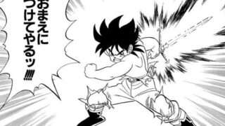

# どんな唐突な話題も絶対自然に切り出せるスキーム 必殺「アバンストラッシュ」

---
# はじめに

- こんにちは。
- 自分はドラゴンクエストが好きなドラクエ世代の人間です。
- 今日はドラクエ作品にあやかった革新的フレームワークを紹介。

---

# はじめに(つづき)

- 自分発信で個人的な関心事を話す機会ってどれくらいありますか
- 本当に唐突でどうしようもないことって、話したくても話せないことがあります。
  - 話せる時間(T)と場所(P)と相手や状況(O)が限られる
    - そんなことないっておもった方、無計画にはなすと嫌われますよ。
- そこで提案したいのが
- 「どんな唐突な話題も絶対自然に切り出せる必殺のフレームワーク（声大）」

---

# はじめに(つづき)

- 「アバンストラッシュ」は、ドラゴンクエストシリーズの作品「ダイの大冒険」、に出てくる必殺技の名前です。
- 大地を斬り、海を斬り、空を斬る。そしてそのすべてを斬るのがアバンストラッシュです。
- この方法で万事解決。さっそく見ていきましょう。

---

# 本題

- さっそく、やり方をいいます

---

# 事前準備

- まず、切り出したい話題をいくつか用意してください。
  - 好きな動画とかマイナーなコンビニ商品とかなんでもOKですが、周知の事実や普通に話しやすいテーマとかは外してください。

---
# 事前準備(つづき)

- 次に、用意した話題をの３つのカテゴリーに分類しましょう。「大地」「海」「空」の３カテゴリーにわけます。
- 分類する際、ざっくりとでいいので、突拍子もない大地 << 海 << 空 の順に突拍子のなさが上がるように仕分けします。

---

# 具体例

### 

- 「地」 ... <自分自身の込み言ったトピック> [大地](#daichi)
- 「海」 ... <時事ネタ> [海](#umi)
- 「空」 ... <どっちでもないもの。なつかしネタとか。 [空](#sora)

---

# 大地

<大地ネタ>

---

# 海

<海ネタ>

---

# 空

<空ネタ>

---

# まとめ

- いかがでしたか？
- TPOもわきまえず、本当に唐突でどうしようもないことを切り出したい願望を抱えている方
- ぶっちゃけ小心者だけど、本当に唐突でどうしようもないことを切り出したい願望を抱えている方
- 明日からこの方法で話題を切り出してみてくださいね。
- アバンストラッシュ！
